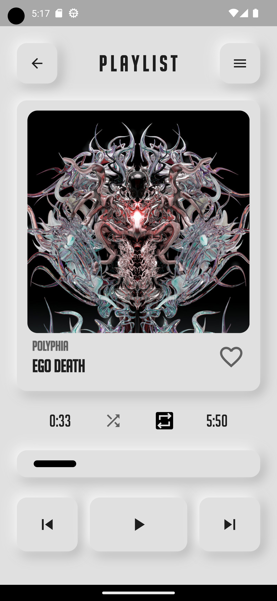
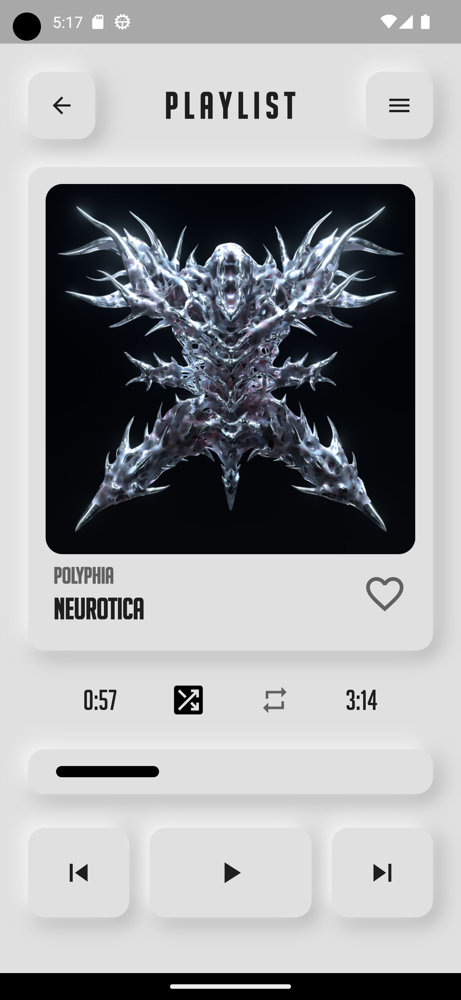
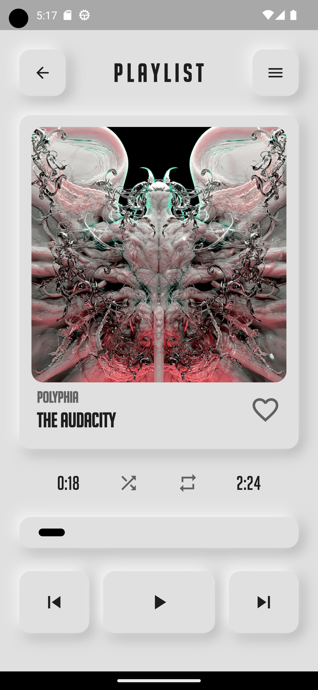

# Flutter Spotify Clone

    

  

    
    
    
    
    

This program is to test flutter and dart, testing out a basic Spotify-like UI with neumorphic design.

# Fonts

The font used in this program, Big Noodle Titling, is available here:

https://www.dafont.com/bignoodletitling.font

# Contribution 

If you'd like to contribute to `flutter_spotify_clone` please submit a pull-request on a feature branch.

# Installing

Clone the repo:

    git clone https://github.com/Sommos/flutter_spotify_clone
    cd flutter_spotify_clone